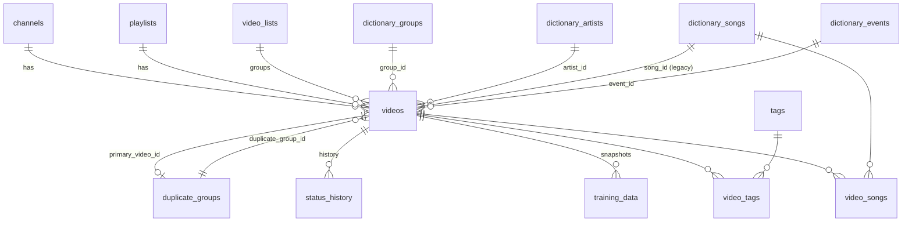
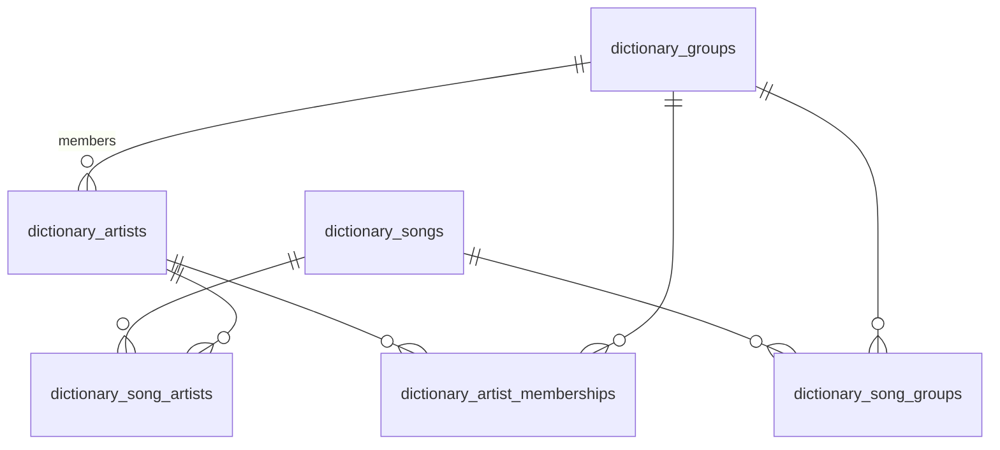

# Entities & Relationships

> 🌐 **Languages:** **English** · [Русский](./entities.ru.md)
>
> ⬅️ Back to [Project Overview](./overview.en.md)

This document describes the VidPulse data model: every table, its columns, keys, and how the entities relate. The schema is defined by the Knex migrations in [`migrations/`](../migrations) and is the source of truth; this page is a curated, human-readable view of the **current** schema (after all migrations are applied).

> **Notation:** 🔑 = primary key · 🔗 = foreign key · `*` = `NOT NULL` · _(unique)_ = unique constraint. SQLite types are simplified (TEXT/INTEGER/REAL/BOOLEAN/TIMESTAMP).

---

## Domain map

The model has three areas:

1. **Sources** — where videos come from: `channels`, `playlists`.
2. **Videos** — the core entity and its satellites: `videos`, `status_history`, `training_data`, `duplicate_groups`, `video_lists`, `tags`.
3. **Dictionary** — curated reference data: `dictionary_groups`, `dictionary_artists`, `dictionary_songs`, `dictionary_events`, `dictionary_aliases`, plus link tables.

Junction (many-to-many) tables connect these areas: `video_tags`, `video_songs`, `dictionary_song_artists`, `dictionary_song_groups`, `dictionary_artist_memberships`.

---

## ER diagram — Video domain

## ER diagram — Dictionary domain

> `dictionary_aliases` is **polymorphic** — it points at any dictionary entity via `(entity_type, entity_id)` rather than a database foreign key, so it is not drawn above.

---

## Sources

### `channels`

YouTube channels that are tracked for new videos.

| Column            | Type      | Notes           |
| ----------------- | --------- | --------------- |
| `id` 🔑           | INTEGER   | auto-increment  |
| `youtube_id` \*   | TEXT      | _(unique)_      |
| `title` \*        | TEXT      |                 |
| `thumbnail_url`   | TEXT      |                 |
| `is_favorite`     | BOOLEAN   | default `false` |
| `added_at`        | TIMESTAMP | default now     |
| `last_checked_at` | TIMESTAMP | last sync time  |

### `playlists`

YouTube playlists that are tracked for new videos.

| Column            | Type      | Notes          |
| ----------------- | --------- | -------------- |
| `id` 🔑           | INTEGER   | auto-increment |
| `youtube_id` \*   | TEXT      | _(unique)_     |
| `title` \*        | TEXT      |                |
| `added_at`        | TIMESTAMP | default now    |
| `last_checked_at` | TIMESTAMP |                |

---

## Videos

### `videos`

The central entity. It carries **denormalized** metadata fields (text), **foreign keys** to the dictionary, and YouTube/processing fields.

> 📐 **Target denormalization model:** today the text fields (`group_name`/`artist_name`/`event`) and the FKs (`group_id`/…) are a dual source of truth. The agreed direction is to keep only the raw parse result in the text columns and derive the display value as `COALESCE(dictionary, parse)`. See [ADR 0002](./adr/0002-raw-parse-vs-canonical-display.md).

| Column                  | Type      | Notes                                          |
| ----------------------- | --------- | ---------------------------------------------- |
| `id` 🔑                 | INTEGER   | auto-increment                                 |
| `youtube_id` \*         | TEXT      | _(unique)_                                     |
| `channel_id` 🔗         | INTEGER   | → `channels.id` (CASCADE)                      |
| `playlist_id` 🔗        | INTEGER   | → `playlists.id` (CASCADE)                     |
| `original_title` \*     | TEXT      | raw YouTube title                              |
| `url`                   | TEXT      |                                                |
| `published_at`          | TIMESTAMP |                                                |
| `status`                | TEXT      | default `pending` (e.g. `needs_review`, `new`) |
| `duplicate_group_id` 🔗 | INTEGER   | → `duplicate_groups.id` (SET NULL)             |
| `perf_date`             | TIMESTAMP | performance date                               |
| `group_name`            | TEXT      | denormalized group                             |
| `artist_name`           | TEXT      | denormalized artist (solo fancams)             |
| `song_title`            | TEXT      | **legacy** denormalized song (see note)        |
| `event`                 | TEXT      | denormalized event (e.g. `@MCOUNTDOWN`)        |
| `camera_type`           | TEXT      | e.g. fancam, 4K                                |
| `description`           | TEXT      | YouTube description                            |
| `duration_seconds`      | INTEGER   |                                                |
| `is_fancam`             | BOOLEAN   |                                                |
| `fancam_confidence`     | REAL      |                                                |
| `group_id` 🔗           | INTEGER   | → `dictionary_groups.id` (SET NULL)            |
| `artist_id` 🔗          | INTEGER   | → `dictionary_artists.id` (SET NULL)           |
| `song_id` 🔗            | INTEGER   | **legacy** → `dictionary_songs.id` (SET NULL)  |
| `event_id` 🔗           | INTEGER   | → `dictionary_events.id` (SET NULL)            |
| `is_own_group_song`     | BOOLEAN   | song belongs to the parsed group               |
| `is_own_artist_song`    | BOOLEAN   | song belongs to the parsed artist              |
| `video_list_id` 🔗      | INTEGER   | → `video_lists.id` (SET NULL)                  |
| `file_path`             | TEXT      |                                                |
| `preview_path`          | TEXT      |                                                |
| `error_log`             | TEXT      |                                                |
| `created_at`            | TIMESTAMP | default now                                    |
| `updated_at`            | TIMESTAMP | default now                                    |

**Indexes:** `status`, `duplicate_group_id`, `group_id`, `artist_id`, `song_id`, `event_id`, and a composite `videos_perf_meta_idx` on `(perf_date, group_name, artist_name, song_title, event)`.

> ⚠️ **Songs are many-to-many.** `videos.song_id` / `videos.song_title` are **legacy** single-value columns kept for backward compatibility. The authoritative set of songs for a video is the **`video_songs`** junction table — a video may have several songs.

### `duplicate_groups`

Groups videos detected as duplicates of one another.

| Column                | Type      | Notes                                                      |
| --------------------- | --------- | ---------------------------------------------------------- |
| `id` 🔑               | INTEGER   | auto-increment                                             |
| `primary_video_id` 🔗 | INTEGER   | → `videos.id` (SET NULL); the canonical video of the group |
| `created_at`          | TIMESTAMP | default now                                                |

### `status_history`

Append-only log of a video's status transitions.

| Column           | Type      | Notes                   |
| ---------------- | --------- | ----------------------- |
| `id` 🔑          | INTEGER   | auto-increment          |
| `video_id` 🔗 \* | INTEGER   | → `videos.id` (CASCADE) |
| `old_status`     | TEXT      |                         |
| `new_status` \*  | TEXT      |                         |
| `changed_at`     | TIMESTAMP | default now             |

### `training_data`

Snapshot of finalized metadata per video, used as ML training data.

| Column                | Type      | Notes                                      |
| --------------------- | --------- | ------------------------------------------ |
| `id` 🔑               | INTEGER   | auto-increment                             |
| `video_id` 🔗 \*      | INTEGER   | → `videos.id` (CASCADE)                    |
| `original_title` \*   | TEXT      |                                            |
| `final_metadata_json` | JSON      | finalized metadata (incl. `song_titles[]`) |
| `created_at`          | TIMESTAMP | default now                                |

### `video_lists`

User-defined collections of videos.

| Column       | Type      | Notes          |
| ------------ | --------- | -------------- |
| `id` 🔑      | INTEGER   | auto-increment |
| `name` \*    | TEXT      |                |
| `color` \*   | TEXT      | _(unique)_     |
| `created_at` | TIMESTAMP | default now    |
| `updated_at` | TIMESTAMP | default now    |

### `tags`

| Column    | Type    | Notes                                 |
| --------- | ------- | ------------------------------------- |
| `id` 🔑   | INTEGER | auto-increment                        |
| `name` \* | TEXT    | _(unique)_ — e.g. `shorts`, `private` |

---

## Dictionary

### `dictionary_groups`

| Column      | Type    | Notes                       |
| ----------- | ------- | --------------------------- |
| `id` 🔑     | INTEGER | auto-increment              |
| `name` \*   | TEXT    | _(unique)_                  |
| `type` \*   | TEXT    | `male` / `female` / `mixed` |
| `active` \* | BOOLEAN | default `true`              |

### `dictionary_artists`

| Column           | Type    | Notes                              |
| ---------------- | ------- | ---------------------------------- |
| `id` 🔑          | INTEGER | auto-increment                     |
| `name` \*        | TEXT    |                                    |
| `group_id` 🔗 \* | INTEGER | → `dictionary_groups.id` (CASCADE) |
|                  |         | _(unique)_ on `(name, group_id)`   |

### `dictionary_songs`

| Column     | Type    | Notes                     |
| ---------- | ------- | ------------------------- |
| `id` 🔑    | INTEGER | auto-increment            |
| `title` \* | TEXT    |                           |
| `artist`   | TEXT    | optional free-text artist |

### `dictionary_events`

| Column    | Type    | Notes          |
| --------- | ------- | -------------- |
| `id` 🔑   | INTEGER | auto-increment |
| `name` \* | TEXT    | _(unique)_     |

### `dictionary_aliases`

Polymorphic alternate spellings/lookups for any dictionary entity.

| Column           | Type    | Notes                                           |
| ---------------- | ------- | ----------------------------------------------- |
| `id` 🔑          | INTEGER | auto-increment                                  |
| `entity_type` \* | TEXT    | `group` / `artist` / `song` / `event`           |
| `entity_id` \*   | INTEGER | id within the target table (not a DB FK)        |
| `alias` \*       | TEXT    | _(unique)_ on `(entity_type, entity_id, alias)` |

### `settings`

| Column     | Type | Notes |
| ---------- | ---- | ----- |
| `key` 🔑   | TEXT |       |
| `value` \* | TEXT |       |

---

## Junction (many-to-many) tables

### `video_songs` — videos ↔ songs

The **single source of truth** for which songs appear in a video.

| Column           | Type    | Notes                                       |
| ---------------- | ------- | ------------------------------------------- |
| `video_id` 🔗 \* | INTEGER | → `videos.id` (CASCADE)                     |
| `song_id` 🔗 \*  | INTEGER | → `dictionary_songs.id` (CASCADE)           |
| 🔑               |         | composite primary key `(video_id, song_id)` |

### `video_tags` — videos ↔ tags

| Column           | Type    | Notes                                      |
| ---------------- | ------- | ------------------------------------------ |
| `video_id` 🔗 \* | INTEGER | → `videos.id` (CASCADE)                    |
| `tag_id` 🔗 \*   | INTEGER | → `tags.id` (CASCADE)                      |
| 🔑               |         | composite primary key `(video_id, tag_id)` |

### `dictionary_song_artists` — songs ↔ artists

| Column            | Type    | Notes                                        |
| ----------------- | ------- | -------------------------------------------- |
| `song_id` 🔗 \*   | INTEGER | → `dictionary_songs.id` (CASCADE)            |
| `artist_id` 🔗 \* | INTEGER | → `dictionary_artists.id` (CASCADE)          |
| 🔑                |         | composite primary key `(song_id, artist_id)` |

### `dictionary_song_groups` — songs ↔ groups

| Column           | Type    | Notes                                       |
| ---------------- | ------- | ------------------------------------------- |
| `song_id` 🔗 \*  | INTEGER | → `dictionary_songs.id` (CASCADE)           |
| `group_id` 🔗 \* | INTEGER | → `dictionary_groups.id` (CASCADE)          |
| 🔑               |         | composite primary key `(song_id, group_id)` |

### `dictionary_artist_memberships` — artists ↔ groups (over time)

Captures an artist's membership in a group, with activity type, status and date range.

| Column             | Type      | Notes                               |
| ------------------ | --------- | ----------------------------------- |
| `id` 🔑            | INTEGER   | auto-increment                      |
| `artist_id` 🔗 \*  | INTEGER   | → `dictionary_artists.id` (CASCADE) |
| `group_id` 🔗      | INTEGER   | → `dictionary_groups.id` (SET NULL) |
| `activity_type` \* | TEXT      | e.g. `group` / `solo`               |
| `status` \*        | TEXT      | e.g. `active` / `former` / `hiatus` |
| `started_at`       | DATE      |                                     |
| `ended_at`         | DATE      |                                     |
| `is_primary` \*    | BOOLEAN   | default `false`                     |
| `created_at`       | TIMESTAMP | default now                         |
| `updated_at`       | TIMESTAMP | default now                         |

---

## Auxiliary

### `event_log`

Application-wide audit log.

| Column          | Type      | Notes                |
| --------------- | --------- | -------------------- |
| `id` 🔑         | INTEGER   | auto-increment       |
| `event_type` \* | TEXT      | indexed              |
| `description`   | TEXT      |                      |
| `metadata`      | TEXT      | JSON payload         |
| `created_at`    | TIMESTAMP | default now; indexed |

---

## Relationship summary

| From                 | Cardinality | To                    | Via                                      |
| -------------------- | ----------- | --------------------- | ---------------------------------------- |
| `channels`           | 1 → N       | `videos`              | `videos.channel_id`                      |
| `playlists`          | 1 → N       | `videos`              | `videos.playlist_id`                     |
| `video_lists`        | 1 → N       | `videos`              | `videos.video_list_id`                   |
| `duplicate_groups`   | 1 → N       | `videos`              | `videos.duplicate_group_id`              |
| `videos`             | 1 → 0..1    | `duplicate_groups`    | `duplicate_groups.primary_video_id`      |
| `videos`             | 1 → N       | `status_history`      | `status_history.video_id`                |
| `videos`             | 1 → N       | `training_data`       | `training_data.video_id`                 |
| `videos`             | N ↔ N       | `tags`                | `video_tags`                             |
| `videos`             | N ↔ N       | `dictionary_songs`    | **`video_songs`** (authoritative)        |
| `dictionary_groups`  | 1 → N       | `dictionary_artists`  | `dictionary_artists.group_id`            |
| `dictionary_groups`  | 1 → N       | `videos`              | `videos.group_id`                        |
| `dictionary_artists` | 1 → N       | `videos`              | `videos.artist_id`                       |
| `dictionary_songs`   | 1 → N       | `videos`              | `videos.song_id` _(legacy)_              |
| `dictionary_events`  | 1 → N       | `videos`              | `videos.event_id`                        |
| `dictionary_songs`   | N ↔ N       | `dictionary_artists`  | `dictionary_song_artists`                |
| `dictionary_songs`   | N ↔ N       | `dictionary_groups`   | `dictionary_song_groups`                 |
| `dictionary_artists` | N ↔ N       | `dictionary_groups`   | `dictionary_artist_memberships`          |
| `dictionary_aliases` | N → 1       | any dictionary entity | `(entity_type, entity_id)` — polymorphic |
