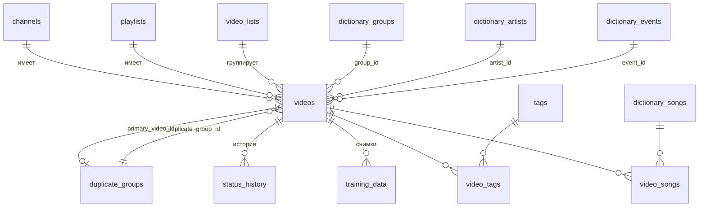
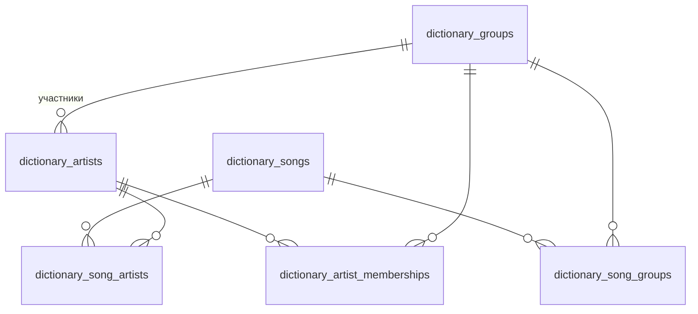

# Сущности и связи

> 🌐 **Языки:** [English](./entities.en.md) · **Русский**
>
> ⬅️ Назад к [Обзору проекта](./overview.ru.md)

Этот документ описывает модель данных VidPulse: каждую таблицу, её колонки, ключи и связи между сущностями. Схема задаётся миграциями Knex в [`migrations/`](../migrations) и является источником истины; данная страница — кураторское, удобочитаемое представление **текущей** схемы (после применения всех миграций).

> **Обозначения:** 🔑 = первичный ключ · 🔗 = внешний ключ · `*` = `NOT NULL` · _(unique)_ = уникальное ограничение. Типы SQLite упрощены (TEXT/INTEGER/REAL/BOOLEAN/TIMESTAMP).

---

## Карта предметной области

Модель состоит из трёх частей:

1. **Источники** — откуда берутся видео: `channels`, `playlists`.
2. **Видео** — центральная сущность и её спутники: `videos`, `status_history`, `training_data`, `duplicate_groups`, `video_lists`, `tags`.
3. **Словарь** — кураторские справочные данные: `dictionary_groups`, `dictionary_artists`, `dictionary_songs`, `dictionary_events`, `dictionary_aliases` и связующие таблицы.

Junction-таблицы (многие-ко-многим) соединяют эти части: `video_tags`, `video_songs`, `dictionary_song_artists`, `dictionary_song_groups`, `dictionary_artist_memberships`.

---

## ER-диаграмма — домен видео

## ER-диаграмма — домен словаря

> `dictionary_aliases` — **полиморфная** таблица: ссылается на любую словарную сущность через `(entity_type, entity_id)`, а не через внешний ключ БД, поэтому на диаграмме не показана.

---

## Источники

### `channels`

YouTube-каналы, отслеживаемые на предмет новых видео.

| Колонка           | Тип       | Примечания                    |
| ----------------- | --------- | ----------------------------- |
| `id` 🔑           | INTEGER   | автоинкремент                 |
| `youtube_id` \*   | TEXT      | _(unique)_                    |
| `title` \*        | TEXT      |                               |
| `thumbnail_url`   | TEXT      |                               |
| `is_favorite`     | BOOLEAN   | по умолчанию `false`          |
| `added_at`        | TIMESTAMP | по умолчанию now              |
| `last_checked_at` | TIMESTAMP | время последней синхронизации |

### `playlists`

YouTube-плейлисты, отслеживаемые на предмет новых видео.

| Колонка           | Тип       | Примечания       |
| ----------------- | --------- | ---------------- |
| `id` 🔑           | INTEGER   | автоинкремент    |
| `youtube_id` \*   | TEXT      | _(unique)_       |
| `title` \*        | TEXT      |                  |
| `added_at`        | TIMESTAMP | по умолчанию now |
| `last_checked_at` | TIMESTAMP |                  |

---

## Видео

### `videos`

Центральная сущность. Содержит **денормализованные** поля метаданных (текст), **внешние ключи** на словарь и поля YouTube/обработки.

> 📐 **Целевая модель денормализации:** сейчас текстовые поля (`group_name`/`artist_name`/`event`) и FK (`group_id`/…) — двойной источник истины. Принятое направление — хранить в тексте только результат парсинга, а отображение выводить как `COALESCE(словарь, парсинг)`. См. [ADR 0002](./adr/0002-raw-parse-vs-canonical-display.md).

| Колонка                 | Тип       | Примечания                                           |
| ----------------------- | --------- | ---------------------------------------------------- |
| `id` 🔑                 | INTEGER   | автоинкремент                                        |
| `youtube_id` \*         | TEXT      | _(unique)_                                           |
| `channel_id` 🔗         | INTEGER   | → `channels.id` (CASCADE)                            |
| `playlist_id` 🔗        | INTEGER   | → `playlists.id` (CASCADE)                           |
| `original_title` \*     | TEXT      | сырое название YouTube                               |
| `url`                   | TEXT      |                                                      |
| `published_at`          | TIMESTAMP |                                                      |
| `status`                | TEXT      | по умолчанию `pending` (напр. `needs_review`, `new`) |
| `duplicate_group_id` 🔗 | INTEGER   | → `duplicate_groups.id` (SET NULL)                   |
| `perf_date`             | TIMESTAMP | дата выступления                                     |
| `group_name`            | TEXT      | денормализованная группа                             |
| `artist_name`           | TEXT      | денормализованный артист (сольные fancam)            |
| `event`                 | TEXT      | денормализованное событие (напр. `@MCOUNTDOWN`)      |
| `camera_type`           | TEXT      | напр. fancam, 4K                                     |
| `description`           | TEXT      | описание YouTube                                     |
| `duration_seconds`      | INTEGER   |                                                      |
| `is_fancam`             | BOOLEAN   |                                                      |
| `fancam_confidence`     | REAL      |                                                      |
| `group_id` 🔗           | INTEGER   | → `dictionary_groups.id` (SET NULL)                  |
| `artist_id` 🔗          | INTEGER   | → `dictionary_artists.id` (SET NULL)                 |
| `event_id` 🔗           | INTEGER   | → `dictionary_events.id` (SET NULL)                  |
| `is_own_group_song`     | BOOLEAN   | песня принадлежит разобранной группе                 |
| `is_own_artist_song`    | BOOLEAN   | песня принадлежит разобранному артисту               |
| `video_list_id` 🔗      | INTEGER   | → `video_lists.id` (SET NULL)                        |
| `file_path`             | TEXT      |                                                      |
| `preview_path`          | TEXT      |                                                      |
| `error_log`             | TEXT      |                                                      |
| `created_at`            | TIMESTAMP | по умолчанию now                                     |
| `updated_at`            | TIMESTAMP | по умолчанию now                                     |

**Индексы:** `status`, `duplicate_group_id`, `group_id`, `artist_id`, `event_id`, а также составной `videos_perf_meta_idx` по `(perf_date, group_name, artist_name, event)`.

> ⚠️ **Песни живут только в `video_songs`.** Легаси-колонки `videos.song_id` / `videos.song_title` **удалены** (TASK-3); песни видео — это строки в **`video_songs`** (сырой тайтл + опциональный канон `song_id` + порядок).

### `duplicate_groups`

Группирует видео, определённые как дубликаты друг друга.

| Колонка               | Тип       | Примечания                                          |
| --------------------- | --------- | --------------------------------------------------- |
| `id` 🔑               | INTEGER   | автоинкремент                                       |
| `primary_video_id` 🔗 | INTEGER   | → `videos.id` (SET NULL); каноническое видео группы |
| `created_at`          | TIMESTAMP | по умолчанию now                                    |

### `status_history`

Журнал переходов статуса видео (только добавление).

| Колонка          | Тип       | Примечания              |
| ---------------- | --------- | ----------------------- |
| `id` 🔑          | INTEGER   | автоинкремент           |
| `video_id` 🔗 \* | INTEGER   | → `videos.id` (CASCADE) |
| `old_status`     | TEXT      |                         |
| `new_status` \*  | TEXT      |                         |
| `changed_at`     | TIMESTAMP | по умолчанию now        |

### `training_data`

Снимок финализированных метаданных по видео, используется как обучающие данные.

| Колонка               | Тип       | Примечания                                  |
| --------------------- | --------- | ------------------------------------------- |
| `id` 🔑               | INTEGER   | автоинкремент                               |
| `video_id` 🔗 \*      | INTEGER   | → `videos.id` (CASCADE)                     |
| `original_title` \*   | TEXT      |                                             |
| `final_metadata_json` | JSON      | финальные метаданные (вкл. `song_titles[]`) |
| `created_at`          | TIMESTAMP | по умолчанию now                            |

### `video_lists`

Пользовательские подборки видео.

| Колонка      | Тип       | Примечания       |
| ------------ | --------- | ---------------- |
| `id` 🔑      | INTEGER   | автоинкремент    |
| `name` \*    | TEXT      |                  |
| `color` \*   | TEXT      | _(unique)_       |
| `created_at` | TIMESTAMP | по умолчанию now |
| `updated_at` | TIMESTAMP | по умолчанию now |

### `tags`

| Колонка   | Тип     | Примечания                             |
| --------- | ------- | -------------------------------------- |
| `id` 🔑   | INTEGER | автоинкремент                          |
| `name` \* | TEXT    | _(unique)_ — напр. `shorts`, `private` |

---

## Словарь

### `dictionary_groups`

| Колонка     | Тип     | Примечания                  |
| ----------- | ------- | --------------------------- |
| `id` 🔑     | INTEGER | автоинкремент               |
| `name` \*   | TEXT    | _(unique)_                  |
| `type` \*   | TEXT    | `male` / `female` / `mixed` |
| `active` \* | BOOLEAN | по умолчанию `true`         |

### `dictionary_artists`

| Колонка          | Тип     | Примечания                         |
| ---------------- | ------- | ---------------------------------- |
| `id` 🔑          | INTEGER | автоинкремент                      |
| `name` \*        | TEXT    |                                    |
| `group_id` 🔗 \* | INTEGER | → `dictionary_groups.id` (CASCADE) |
|                  |         | _(unique)_ по `(name, group_id)`   |

### `dictionary_songs`

| Колонка    | Тип     | Примечания                      |
| ---------- | ------- | ------------------------------- |
| `id` 🔑    | INTEGER | автоинкремент                   |
| `title` \* | TEXT    |                                 |
| `artist`   | TEXT    | необязательный текстовый артист |

### `dictionary_events`

| Колонка   | Тип     | Примечания    |
| --------- | ------- | ------------- |
| `id` 🔑   | INTEGER | автоинкремент |
| `name` \* | TEXT    | _(unique)_    |

### `dictionary_aliases`

Полиморфные альтернативные написания/псевдонимы для любой словарной сущности.

| Колонка          | Тип     | Примечания                                      |
| ---------------- | ------- | ----------------------------------------------- |
| `id` 🔑          | INTEGER | автоинкремент                                   |
| `entity_type` \* | TEXT    | `group` / `artist` / `song` / `event`           |
| `entity_id` \*   | INTEGER | id в целевой таблице (не FK БД)                 |
| `alias` \*       | TEXT    | _(unique)_ по `(entity_type, entity_id, alias)` |

### `settings`

| Колонка    | Тип  | Примечания |
| ---------- | ---- | ---------- |
| `key` 🔑   | TEXT |            |
| `value` \* | TEXT |            |

---

## Junction-таблицы (многие-ко-многим)

### `video_songs` — видео ↔ песни

**Единственный источник истины** об упорядоченном наборе песен видео. Каждая строка хранит сырой
распознанный тайтл (evidence) и, при совпадении, ссылку на каноническую песню словаря; отображение =
`COALESCE(dictionary_songs.title, raw_title)` (TASK-2 / ADR 0002).

| Колонка          | Тип     | Примечания                                                        |
| ---------------- | ------- | ----------------------------------------------------------------- |
| `video_id` 🔗 \* | INTEGER | → `videos.id` (CASCADE)                                           |
| `position` \*    | INTEGER | порядок песни в видео (с 0)                                       |
| `raw_title` \*   | TEXT    | сырой распознанный тайтл песни (evidence)                         |
| `song_id` 🔗     | INTEGER | → `dictionary_songs.id` (SET NULL); **null если не сопоставлено** |
| 🔑               |         | составной первичный ключ `(video_id, position)`                   |

### `video_tags` — видео ↔ теги

| Колонка          | Тип     | Примечания                                    |
| ---------------- | ------- | --------------------------------------------- |
| `video_id` 🔗 \* | INTEGER | → `videos.id` (CASCADE)                       |
| `tag_id` 🔗 \*   | INTEGER | → `tags.id` (CASCADE)                         |
| 🔑               |         | составной первичный ключ `(video_id, tag_id)` |

### `dictionary_song_artists` — песни ↔ артисты

| Колонка           | Тип     | Примечания                                      |
| ----------------- | ------- | ----------------------------------------------- |
| `song_id` 🔗 \*   | INTEGER | → `dictionary_songs.id` (CASCADE)               |
| `artist_id` 🔗 \* | INTEGER | → `dictionary_artists.id` (CASCADE)             |
| 🔑                |         | составной первичный ключ `(song_id, artist_id)` |

### `dictionary_song_groups` — песни ↔ группы

| Колонка          | Тип     | Примечания                                     |
| ---------------- | ------- | ---------------------------------------------- |
| `song_id` 🔗 \*  | INTEGER | → `dictionary_songs.id` (CASCADE)              |
| `group_id` 🔗 \* | INTEGER | → `dictionary_groups.id` (CASCADE)             |
| 🔑               |         | составной первичный ключ `(song_id, group_id)` |

### `dictionary_artist_memberships` — артисты ↔ группы (во времени)

Фиксирует членство артиста в группе с типом активности, статусом и диапазоном дат.

| Колонка            | Тип       | Примечания                           |
| ------------------ | --------- | ------------------------------------ |
| `id` 🔑            | INTEGER   | автоинкремент                        |
| `artist_id` 🔗 \*  | INTEGER   | → `dictionary_artists.id` (CASCADE)  |
| `group_id` 🔗      | INTEGER   | → `dictionary_groups.id` (SET NULL)  |
| `activity_type` \* | TEXT      | напр. `group` / `solo`               |
| `status` \*        | TEXT      | напр. `active` / `former` / `hiatus` |
| `started_at`       | DATE      |                                      |
| `ended_at`         | DATE      |                                      |
| `is_primary` \*    | BOOLEAN   | по умолчанию `false`                 |
| `created_at`       | TIMESTAMP | по умолчанию now                     |
| `updated_at`       | TIMESTAMP | по умолчанию now                     |

---

## Вспомогательные

### `event_log`

Общесистемный журнал аудита.

| Колонка         | Тип       | Примечания                      |
| --------------- | --------- | ------------------------------- |
| `id` 🔑         | INTEGER   | автоинкремент                   |
| `event_type` \* | TEXT      | индексируется                   |
| `description`   | TEXT      |                                 |
| `metadata`      | TEXT      | JSON-данные                     |
| `created_at`    | TIMESTAMP | по умолчанию now; индексируется |

---

## Сводка связей

| Откуда               | Кардинальность | Куда                     | Через                                   |
| -------------------- | -------------- | ------------------------ | --------------------------------------- |
| `channels`           | 1 → N          | `videos`                 | `videos.channel_id`                     |
| `playlists`          | 1 → N          | `videos`                 | `videos.playlist_id`                    |
| `video_lists`        | 1 → N          | `videos`                 | `videos.video_list_id`                  |
| `duplicate_groups`   | 1 → N          | `videos`                 | `videos.duplicate_group_id`             |
| `videos`             | 1 → 0..1       | `duplicate_groups`       | `duplicate_groups.primary_video_id`     |
| `videos`             | 1 → N          | `status_history`         | `status_history.video_id`               |
| `videos`             | 1 → N          | `training_data`          | `training_data.video_id`                |
| `videos`             | N ↔ N          | `tags`                   | `video_tags`                            |
| `videos`             | N ↔ N          | `dictionary_songs`       | **`video_songs`** (авторитетная)        |
| `dictionary_groups`  | 1 → N          | `dictionary_artists`     | `dictionary_artists.group_id`           |
| `dictionary_groups`  | 1 → N          | `videos`                 | `videos.group_id`                       |
| `dictionary_artists` | 1 → N          | `videos`                 | `videos.artist_id`                      |
| `dictionary_songs`   | 1 → N          | `videos`                 | `videos.song_id` _(легаси)_             |
| `dictionary_events`  | 1 → N          | `videos`                 | `videos.event_id`                       |
| `dictionary_songs`   | N ↔ N          | `dictionary_artists`     | `dictionary_song_artists`               |
| `dictionary_songs`   | N ↔ N          | `dictionary_groups`      | `dictionary_song_groups`                |
| `dictionary_artists` | N ↔ N          | `dictionary_groups`      | `dictionary_artist_memberships`         |
| `dictionary_aliases` | N → 1          | любая словарная сущность | `(entity_type, entity_id)` — полиморфно |
